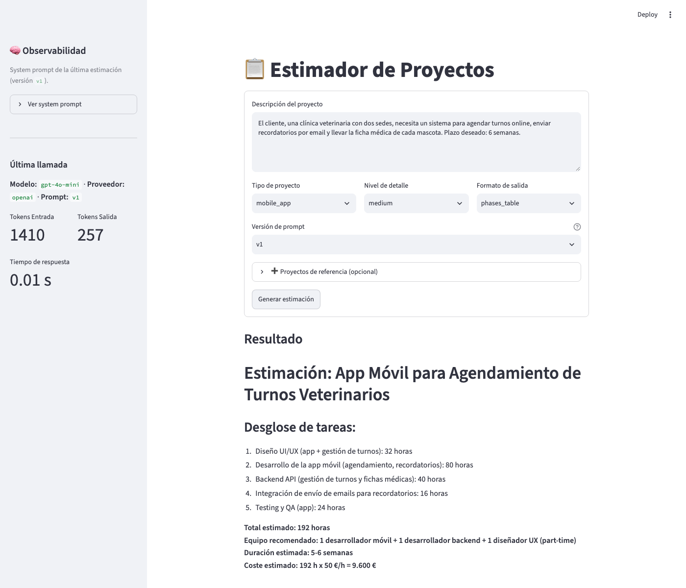

# Estimador CAG

Servicio de IA (FastAPI) que recibe una descripción estructurada de un proyecto y devuelve una estimación de software generada por un LLM, más un cliente web (Streamlit) con formulario tipado.

Arquitectura:

```
Streamlit (formulario tipado)
        │  HTTP (POST /api/v1/estimate, bloqueante)
        ▼
FastAPI ── Jinja2 (prompts versionados) ── LiteLLM Router (fallback openai↔anthropic)
        │
        ├── Redis (cache exact-match)
        └── structlog (logging estructurado)
```

Usa arquitectura **CAG (Cache-Augmented Generation)**: un conjunto de estimaciones previas se inyecta como contexto estático (few-shot) directamente en el prompt de cada petición, vía templates Jinja2 versionados (`app/prompts/estimation/`). No hay base de datos vectorial ni búsqueda semántica.

## Requisitos

- Python 3.13 o superior
- [uv](https://docs.astral.sh/uv/)
- Docker (para levantar Redis)
- Una API key de OpenAI y/o de Anthropic

## Instalación

```bash
uv sync
cp .env.example .env
```

Después edita `.env` y rellena los valores (ver la siguiente sección).

## Configuración

Las variables se leen del archivo `.env`. Cualquier variable que falte usa su valor por defecto.

| Variable | Descripción | Por defecto |
|---|---|---|
| `OPENAI_API_KEY` | API key de OpenAI | sin valor |
| `ANTHROPIC_API_KEY` | API key de Anthropic | sin valor |
| `LLM_PROVIDER` | Proveedor primario: `openai` o `anthropic` | `openai` |
| `LLM_MODEL` | Modelo del proveedor primario | `gpt-4o-mini` |
| `APP_ENV` | Entorno de ejecución (`development` → logs en consola, `production` → logs en JSON) | `development` |
| `LOG_LEVEL` | Nivel de logging | `DEBUG` |
| `REDIS_URL` | Conexión al cache exact-match | `redis://localhost:6379/0` |
| `CACHE_TTL_SECONDS` | TTL de las entradas en cache | `86400` (24h) |
| `BACKEND_URL` | URL del servicio IA que consume el cliente Streamlit | `http://localhost:8000` |

Con **una sola** API key configurada, el servicio funciona sin fallback. Con las dos, si el proveedor primario falla (rate limit, error 5xx, timeout), el [Router de LiteLLM](https://docs.litellm.ai/) reintenta automáticamente con el otro proveedor.

El archivo `.env` contiene secretos y está en el `.gitignore`. No lo subas al repositorio.

## Ejecución

Se necesitan **tres procesos** corriendo en paralelo (en desarrollo, en terminales separadas):

**1. Redis** (cache exact-match):

```bash
docker compose up -d redis
```

**2. Servicio IA (FastAPI)** — arráncalo desde la raíz del proyecto, porque el `.env` se lee desde la carpeta actual:

```bash
uv run uvicorn app.main:app --reload
```

La documentación interactiva (Swagger) queda en http://localhost:8000/docs.

**3. Cliente web (Streamlit)** — es un cliente HTTP real del servicio IA (necesita el paso anterior corriendo):

```bash
uv run streamlit run streamlit_app.py
```

La aplicación se abre en http://localhost:8501.

## Endpoints

### `GET /health`

Devuelve el estado del servicio, el entorno, el proveedor y el modelo activos.

### `POST /api/v1/estimate`

Recibe una descripción estructurada del proyecto y devuelve la estimación completa (bloqueante). Acepta `?prompt_version=v1|v2` como query param opcional (default `v1`).

```bash
curl -X POST "http://localhost:8000/api/v1/estimate?prompt_version=v1" \
  -H "Content-Type: application/json" \
  -d '{
    "description": "El cliente necesita una landing page con formulario de contacto. Plazo de 2 semanas. El diseño ya existe en Figma.",
    "project_type": "web_saas",
    "detail_level": "medium",
    "output_format": "phases_table"
  }'
```

Campos de `EstimationRequest`:

| Campo | Tipo | Descripción |
|---|---|---|
| `description` | string (20–2000 caracteres) | Descripción del proyecto |
| `project_type` | enum | `mobile_app` \| `web_saas` \| `internal_tool` \| `data_pipeline` |
| `detail_level` | enum | `summary` \| `medium` \| `detailed` |
| `output_format` | enum | `phases_table` \| `line_items` \| `narrative` |
| `reference_projects` | lista opcional | Proyectos pasados similares (`name`, `description`, `hours`), como calibración |

Respuesta (`EstimationResponse`):

```json
{
  "text": "## Estimación: Landing Page ...",
  "prompt_version": "v1",
  "model": "gpt-4o-mini-2024-07-18",
  "provider": "openai",
  "input_tokens": 856,
  "output_tokens": 204,
  "created_at": "2026-09-22T00:27:46.008932Z"
}
```

Códigos de error:

| Código | Causa |
|---|---|
| `422` | El body no cumple la validación, o `prompt_version` no existe. |
| `500` | El servicio está mal configurado: falta la API key del proveedor elegido. |
| `502` | El proveedor de LLM falló o devolvió una estimación incompleta. |
| `503` | El proveedor limita las peticiones o la cuenta no tiene saldo. |

El detalle de cada error queda en el log del servidor (structlog) y no se envía al cliente.

### `POST /api/v1/estimate/stream`

Igual que `/estimate` pero via Server-Sent Events: un evento `data` por chunk de texto generado, y un evento final `event: meta` con los metadatos (`model`, `provider`, `input_tokens`, `output_tokens`, `prompt_version`). Si algo falla, se emite un evento `event: error` con un mensaje genérico (la respuesta ya está comprometida a `200 text/event-stream`, no puede convertirse en un código HTTP distinto).

**El cliente Streamlit no usa este endpoint.** El contrato de esta entrega es deliberadamente bloqueante y de texto libre (`EstimationResponse.text`) — es el punto de partida sobre el que se trabaja streaming + salida estructurada en el directo de sesión 04. Este endpoint queda disponible para otros clientes que sí quieran consumir streaming.

## Prompts versionados

Los prompts viven como archivos Jinja2, no como strings en el código:

```
app/prompts/
├── loader.py                    # render_estimation_prompt(request, version="v1")
└── estimation/
    ├── v1/
    │   ├── system.j2             # rol, reglas, bloques condicionales por output_format/detail_level
    │   ├── user.j2                # envuelve la descripción + reference_projects opcionales
    │   └── examples.j2            # few-shot examples, incluido con 
    └── v2/                        # variación deliberada de tono, misma estructura
        ├── system.j2
        ├── user.j2
        └── examples.j2
```

Agregar una versión nueva (`v3/`) no requiere tocar el resto del código: el loader arma un `Environment` de Jinja2 por versión (cacheado), y el endpoint la selecciona con `?prompt_version=v3`. Cada render queda registrado en el log (`prompt_rendered`) con la versión usada y un hash del contenido, para poder auditar en producción qué prompt exacto generó cada estimación.



## Interfaz Web (Streamlit)

`streamlit_app.py` es un **cliente HTTP** del servicio IA (no importa su código Python):

- **Formulario tipado**: descripción + `project_type`/`detail_level`/`output_format`/`prompt_version`, y una sección opcional para proyectos de referencia.
- **Llamada bloqueante**: hace `POST /api/v1/estimate` y muestra un spinner hasta que llega la respuesta completa — sin streaming, a propósito (ver nota en `/estimate/stream` arriba).
- **Observabilidad en la sidebar**: modelo, proveedor y tokens de la última llamada, y el system prompt exacto que se usó (renderizado localmente con el mismo loader, solo para inspección — la llamada real la resuelve el servidor).

## Estructura

```
master-ai-engineering/
├── streamlit_app.py             # Cliente web (formulario, POST bloqueante a /estimate)
├── docker-compose.yml           # Redis para el cache exact-match
├── tests/
│   ├── conftest.py
│   ├── test_api.py              # Endpoints, códigos de error, prompt_version
│   ├── test_cache.py            # Clave de cache exact-match
│   ├── test_config.py           # Settings
│   ├── test_stream_and_ui.py    # Streamlit vía AppTest (mock de httpx)
│   └── prompts/
│       ├── test_estimation_v1.py
│       └── test_estimation_v2.py
├── app/
│   ├── main.py                  # App FastAPI + logging + endpoint /health
│   ├── config.py                # Configuración desde .env
│   ├── schemas.py                # EstimationRequest/Response, enums, ReferenceProject
│   ├── logging_config.py         # structlog (consola en dev, JSON en prod)
│   ├── prompts/
│   │   ├── loader.py              # render_estimation_prompt
│   │   └── estimation/{v1,v2}/    # Templates Jinja2
│   ├── routers/
│   │   └── estimations.py         # POST /estimate y /estimate/stream
│   └── services/
│       ├── llm_service.py         # Wrapper LiteLLM: fallback, cache, streaming
│       └── cache.py                # Cache exact-match sobre Redis
```

## Tests

```bash
uv run pytest -v
```

Todos corren con mocks (sin API keys reales ni Redis corriendo):

- Endpoints y mapeo de errores HTTP (`422`, `500`, `502`, `503`), incluida la versión de prompt.
- Clave de cache exact-match (determinismo, sensibilidad a cada parámetro).
- Templates de prompt (`v1` y `v2`): contenido literal de la descripción, bloques condicionales mutuamente excluyentes, `reference_projects`, versión inexistente.
- Streamlit (`AppTest`) con `httpx.MockTransport`: formulario, respuesta bloqueante, validación.

## Cómo mejorar las estimaciones

El "conocimiento" del sistema son los ejemplos few-shot de `app/prompts/estimation/v1/examples.j2` (y `v2/examples.j2`). Para mejorar la calidad, agregá ejemplos ahí con el mismo formato XML-ish que los existentes — no hace falta tocar código Python. Cada ejemplo nuevo aumenta los tokens de entrada de cada petición, y por tanto su coste.
