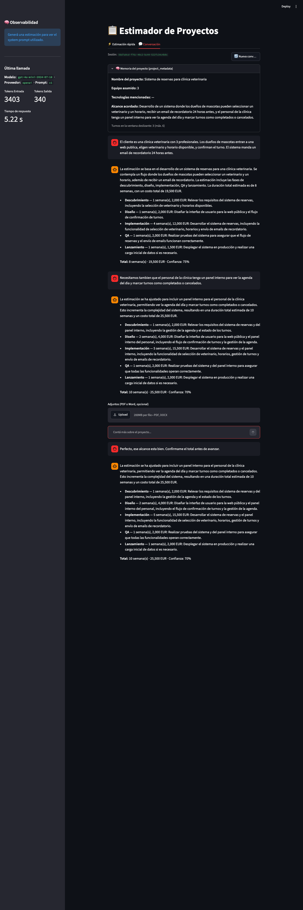

# Estimador CAG

Servicio de IA (FastAPI) que genera estimaciones de software con un LLM, más un cliente web (Streamlit). Soporta dos modos: un formulario tipado de un solo turno, y una conversación multi-turno con memoria de sesión y adjuntos (PDF/Word).

Arquitectura:

```
Streamlit (formulario + conversación)
        │  HTTP (bloqueante, salida estructurada)
        ▼
FastAPI ── Guardrails (input/output) ── Jinja2 (prompts versionados)
        │
        ├── Instructor + LiteLLM Router (fallback openai↔anthropic, salida validada con Pydantic)
        ├── Redis (cache exact-match)
        ├── Redis Stack / redisvl (cache semántica: embeddings + similitud de coseno)
        └── structlog (logging estructurado)
```

Usa arquitectura **CAG (Cache-Augmented Generation)**: un conjunto de estimaciones previas se inyecta como contexto estático (few-shot) directamente en el prompt de cada petición, vía templates Jinja2 versionados (`app/prompts/estimation/`). No hay base de datos vectorial para *conocimiento* (no es RAG) — el único uso de similitud vectorial en el sistema es la **cache semántica** (ver más abajo), que decide si reutilizar una respuesta ya generada, no qué contexto inyectar en el prompt.

## Requisitos

- Python 3.13 o superior
- [uv](https://docs.astral.sh/uv/)
- Docker (para levantar Redis Stack)
- Una API key de OpenAI y/o de Anthropic — **OpenAI es necesaria siempre** aunque el proveedor primario del LLM sea Anthropic: la moderación de input y los embeddings de la cache semántica son llamadas a la API de OpenAI, independientes de qué proveedor genera la estimación.

## Instalación

```bash
uv sync
cp .env.example .env
```

Después edita `.env` y rellena los valores (ver la siguiente sección).

## Configuración

Las variables se leen del archivo `.env`. Cualquier variable que falte usa su valor por defecto.

| Variable | Descripción | Por defecto |
|---|---|---|
| `OPENAI_API_KEY` | API key de OpenAI (LLM, moderación y embeddings) | sin valor |
| `ANTHROPIC_API_KEY` | API key de Anthropic | sin valor |
| `LLM_PROVIDER` | Proveedor primario: `openai` o `anthropic` | `openai` |
| `LLM_MODEL` | Modelo del proveedor primario | `gpt-4o-mini` |
| `APP_ENV` | Entorno de ejecución (`development` → logs en consola, `production` → logs en JSON) | `development` |
| `LOG_LEVEL` | Nivel de logging | `DEBUG` |
| `REDIS_URL` | Conexión a Redis (cache exact-match y semántica) | `redis://localhost:6379/0` |
| `CACHE_TTL_SECONDS` | TTL de las entradas en cache exact-match | `86400` (24h) |
| `BACKEND_URL` | URL del servicio IA que consume el cliente Streamlit | `http://localhost:8000` |
| `MAX_CONVERSATION_TURNS` | Ventana deslizante del historial conversacional | `6` |
| `EMBEDDING_MODEL` | Modelo de embeddings para la cache semántica | `text-embedding-3-small` |
| `SEMANTIC_CACHE_THRESHOLD` | Similitud de coseno mínima para servir un hit (0–1) | `0.85` |
| `SEMANTIC_CACHE_TTL_SECONDS` | TTL de las entradas en cache semántica | `86400` (24h) |
| `SEMANTIC_CACHE_LOG_ONLY` | Si es `true`, solo loguea el score sin servir hits (para calibrar el threshold) | `false` |

Con **una sola** API key de LLM configurada, el servicio funciona sin fallback. Con las dos, si el proveedor primario falla (rate limit, error 5xx, timeout), el [Router de LiteLLM](https://docs.litellm.ai/) reintenta automáticamente con el otro proveedor — incluso en las llamadas de salida estructurada (ver más abajo).

El archivo `.env` contiene secretos y está en el `.gitignore`. No lo subas al repositorio.

## Ejecución

Se necesitan **tres procesos** corriendo en paralelo (en desarrollo, en terminales separadas):

**1. Redis Stack** (cache exact-match + cache semántica):

```bash
docker compose up -d redis
```

Usa `redis/redis-stack-server`, no el `redis:7-alpine` vanilla — la cache semántica necesita el módulo RediSearch que solo trae la imagen Stack.

**2. Servicio IA (FastAPI)** — arráncalo desde la raíz del proyecto, porque el `.env` se lee desde la carpeta actual:

```bash
uv run uvicorn app.main:app --reload
```

La documentación interactiva (Swagger) queda en http://localhost:8000/docs.

**3. Cliente web (Streamlit)** — es un cliente HTTP real del servicio IA (necesita el paso anterior corriendo):

```bash
uv run streamlit run streamlit_app.py
```

La aplicación se abre en http://localhost:8501.

## Guardrails

Corren en `app/guardrails/`, antes (input) y después (output) de la llamada al LLM, en los dos endpoints de estimación.

**Input** (`app/guardrails/input.py`, función `check_input`) — tres capas, cualquiera lanza `InputGuardrailViolation` → `400`:

1. **Moderación** (OpenAI Moderation API): odio, violencia, contenido sexual, etc. Se salta sola si no hay `OPENAI_API_KEY`.
2. **Prompt-injection** (heurística por regex): patrones como "ignora las instrucciones anteriores", tags `<system>`, "ahora sos...".
3. **PII** (heurística por regex): emails, IBAN, teléfonos. A propósito no exhaustiva — es una demostración del *patrón*, no un redactor grado-compliance.

**Output** (`app/guardrails/output.py`, función `enforce_scope_response`) — un *filtro*, nunca lanza: si el LLM devolvió `confidence_pct < 30` sin marcar `"Out of scope:"` al inicio del `summary` (la primera línea de defensa es el `model_validator` del schema, que ya fuerza esto reintentando contra el modelo — este filtro cubre el borde que se le pueda escapar), reescribe la respuesta a una estimación placeholder de una sola fase en vez de devolver algo inconsistente.

## Salida estructurada (Instructor)

`/api/v1/estimate` y `/api/v1/sessions/{id}/estimate` ya **no** devuelven texto libre: el LLM responde con un `EstimationResult` (Pydantic) validado por [Instructor](https://python.useinstructor.com/) — summary, `confidence_pct`, lista de `phases` (cada una con `name`/`duration_weeks`/`cost_eur`/`summary`) y los totales (`total_duration_weeks`/`total_cost_eur`).

Dos `model_validator` de `EstimationResult` (`app/schemas.py`) son las reglas de negocio que el LLM no puede romper — si fallan, Instructor **reintenta automáticamente contra el modelo** (hasta `max_retries=6`) mandándole el error de validación como feedback, en vez de devolver cualquier cosa:

- `total_cost_eur` debe ser exactamente la suma de `phase.cost_eur` de todas las fases.
- Si `confidence_pct < 30`, el `summary` debe empezar con `"Out of scope:"`.

El cliente Instructor envuelve `Router.acompletion` de LiteLLM (no `litellm.completion` directo) — las llamadas con salida estructurada también se benefician del fallback openai↔anthropic, no lo pierden.

> **Limitación conocida:** la aritmética de fases/totales no siempre converge en los 6 reintentos (el modelo recalcula los números distinto en cada intento y a veces no los hace cuadrar a tiempo → `502`), y la calibración de `confidence_pct` todavía es más conservadora de lo esperado en descripciones breves pero razonables (tiende a sub-estimar la confianza y declarar `"Out of scope:"` con más frecuencia de la deseada, a pesar de los ejemplos few-shot y las instrucciones explícitas en `system.j2` calibrando lo contrario). Verificado contra la API real de `gpt-4o-mini`, no es un artefacto de los mocks. Queda documentado para una próxima iteración de calibración de prompt en vez de bloquear el resto de esta entrega.

Y por esto mismo **se eliminó el streaming** (`/estimate/stream` y `/sessions/{id}/estimate/stream` ya no existen): Instructor necesita el objeto completo para poder validarlo contra el schema — no hay "chunk parcial válido" de un JSON estructurado a medio generar, así que no hay nada que transmitir token a token. Las dos pestañas de Streamlit son bloqueantes con un `st.spinner`.

## Cache semántica

Capa de cache adicional sobre la exact-match, solo en `/api/v1/estimate` (el endpoint de formulario — no en el conversacional, donde la respuesta correcta depende de todo el historial previo, no solo del texto del turno actual).

Dos pedidos se consideran "el mismo" cuando:

1. Su **bucket** (`prompt_version:project_type:detail_level:output_format`) coincide exacto — dos pedidos con distinto formulario nunca comparten cache aunque la descripción sea idéntica, porque el prompt renderizado (y por tanto la estimación esperada) es distinto.
2. La similitud de coseno entre los embeddings (`text-embedding-3-small`) de la descripción es `>= SEMANTIC_CACHE_THRESHOLD` (0.85 por defecto).

Implementada en `app/services/semantic_cache.py` con [redisvl](https://docs.redisvl.com/) (`AsyncSearchIndex`) sobre Redis Stack. Se degrada sola a "sin cache" si falta `OPENAI_API_KEY` o si Redis no tiene el módulo RediSearch — nunca rompe el endpoint. `EstimationResponse.cached` refleja la realidad: `true` tanto en un hit exact-match como en uno semántico, `false` cuando se llamó al LLM.

## Endpoints

### `GET /health`

Devuelve el estado del servicio, el entorno, el proveedor y el modelo activos.

### `POST /api/v1/estimate`

Recibe una descripción estructurada del proyecto y devuelve la estimación completa (bloqueante, salida estructurada). Acepta `?prompt_version=v1|v2` como query param opcional (default `v1`).

```bash
curl -X POST "http://localhost:8000/api/v1/estimate?prompt_version=v1" \
  -H "Content-Type: application/json" \
  -d '{
    "description": "El cliente necesita una landing page con formulario de contacto. Plazo de 2 semanas. El diseño ya existe en Figma.",
    "project_type": "web_saas",
    "detail_level": "medium",
    "output_format": "phases_table"
  }'
```

Campos de `EstimationRequest`:

| Campo | Tipo | Descripción |
|---|---|---|
| `description` | string (20–2000 caracteres) | Descripción del proyecto |
| `project_type` | enum | `mobile_app` \| `web_saas` \| `internal_tool` \| `data_pipeline` |
| `detail_level` | enum | `summary` \| `medium` \| `detailed` |
| `output_format` | enum | `phases_table` \| `line_items` \| `narrative` |
| `reference_projects` | lista opcional | Proyectos pasados similares (`name`, `description`, `hours`), como calibración |

Respuesta (`EstimationResponse`):

```json
{
  "result": {
    "summary": "Proyecto bien acotado: landing page de una sola sección...",
    "confidence_pct": 78,
    "phases": [
      {"name": "Diseño", "duration_weeks": 1, "cost_eur": 800, "summary": "Adaptar el diseño de Figma a componentes web."},
      {"name": "Implementación", "duration_weeks": 1, "cost_eur": 1200, "summary": "Maquetado, formulario de contacto y envío de email."}
    ],
    "total_duration_weeks": 2,
    "total_cost_eur": 2000
  },
  "prompt_version": "v1",
  "model": "gpt-4o-mini-2024-07-18",
  "provider": "openai",
  "input_tokens": 2100,
  "output_tokens": 180,
  "created_at": "2026-10-06T00:27:46.008932Z",
  "cached": false,
  "project_metadata": null,
  "history_turns": null
}
```

Códigos de error:

| Código | Causa |
|---|---|
| `400` | El input fue bloqueado por un guardrail (moderación, prompt-injection o PII detectada). |
| `422` | El body no cumple la validación, o `prompt_version` no existe. |
| `500` | El servicio está mal configurado: falta la API key del proveedor elegido. |
| `502` | El proveedor de LLM falló, o Instructor agotó los reintentos sin lograr una respuesta que pase los `model_validator`. |
| `503` | El proveedor limita las peticiones o la cuenta no tiene saldo. |

El detalle de cada error queda en el log del servidor (structlog) y no se envía al cliente.

## Prompts versionados

Los prompts viven como archivos Jinja2, no como strings en el código:

```
app/prompts/
├── loader.py                    # render_estimation_prompt(request, version="v1"), render_session_prompt(...)
└── estimation/
    ├── v1/
    │   ├── system.j2             # rol, reglas, output_schema, bloques condicionales por output_format/detail_level
    │   ├── user.j2                # envuelve la descripción + reference_projects opcionales
    │   ├── session_user.j2        # envuelve el transcript del turno (flujo conversacional)
    │   └── examples.j2            # few-shot examples, incluido con 
    └── v2/                        # variación deliberada de tono, misma estructura
        ├── system.j2
        ├── user.j2
        ├── session_user.j2
        └── examples.j2
```

Agregar una versión nueva (`v3/`) no requiere tocar el resto del código: el loader arma un `Environment` de Jinja2 por versión (cacheado), y el endpoint la selecciona con `?prompt_version=v3`. Cada render queda registrado en el log (`prompt_rendered`) con la versión usada y un hash del contenido, para poder auditar en producción qué prompt exacto generó cada estimación.


## Interfaz Web (Streamlit)

`streamlit_app.py` es un **cliente HTTP** del servicio IA (no importa su código Python). Tiene dos pestañas, las dos bloqueantes (ver nota sobre streaming más arriba):

**⚡ Estimación rápida**:
- Formulario tipado: descripción + `project_type`/`detail_level`/`output_format`/`prompt_version`, y una sección opcional para proyectos de referencia.
- `POST /api/v1/estimate` con un `st.spinner`; el resultado estructurado se renderiza como summary + una fila por fase + totales y confianza.
- Observabilidad en la sidebar: modelo, proveedor y tokens de la última llamada, y el system prompt exacto que se usó (renderizado localmente con el mismo loader, solo para inspección — la llamada real la resuelve el servidor).

**💬 Conversación**:
- Crea una sesión (`POST /sessions`) al cargar la página.
- Chat (`st.chat_input`) + subida de adjuntos (`st.file_uploader`, PDF/Word).
- `POST /sessions/{id}/estimate` con un `st.spinner`; cada turno del asistente se guarda y se re-renderiza igual que en "Estimación rápida" (summary + fases + totales).
- Panel expandible con el `project_metadata` actual y cuántos turnos hay en la ventana deslizante — útil para ver en vivo la separación entre memoria y historial.
- Botón "Nueva conversación" que crea una sesión nueva y resetea el estado local.

## Conversación multi-turno con memoria

El estimador también soporta un flujo **conversacional** con memoria de sesión — el contexto del proyecto se preserva entre turnos sin reenviar todo el historial crudo cada vez.

### `POST /api/v1/sessions`

Crea una sesión vacía y devuelve `{"session_id": "<uuid4>"}`. Las sesiones viven en un diccionario en memoria del proceso — sin base de datos ni Redis. Se pierden al reiniciar el servicio; es una volatilidad aceptada a propósito en esta fase (ver docstring de `SessionStore` en `app/sessions.py`).

### `POST /api/v1/sessions/{session_id}/estimate`

`multipart/form-data` con dos campos:

| Campo | Tipo | Descripción |
|---|---|---|
| `transcript` | string | Lo nuevo que aporta este turno (no todo el historial — eso lo gestiona el servidor) |
| `attachments` | archivos (opcional) | PDFs o `.docx` con especificaciones adicionales |

```bash
SID=$(curl -s -X POST http://localhost:8000/api/v1/sessions | python3 -c "import sys,json;print(json.load(sys.stdin)['session_id'])")

curl -X POST "http://localhost:8000/api/v1/sessions/$SID/estimate" \
  -F "transcript=El cliente es una clínica veterinaria y quiere un sistema de turnos."
```

La respuesta es el mismo `EstimationResponse` del endpoint de formulario, con dos campos extra que solo este endpoint completa: `project_metadata` y `history_turns`.

### Decisión: adjuntos — Camino B (extracción local)

Se eligió **extracción local** (`pypdf` para PDF, `python-docx` para Word) en vez de subir el archivo directo a la Files API de un proveedor (Camino A). Razón: el wrapper de LLM (`llm_service.py`) es agnóstico de proveedor — el Router de LiteLLM hace fallback automático entre OpenAI y Anthropic. Atar un adjunto a la Files API de un proveedor específico rompería esa propiedad justo para las peticiones con adjuntos. Extraer el texto localmente (`app/attachments.py`) mantiene el fallback intacto en todos los casos. El texto de cada adjunto se concatena al transcript con un separador `--- attachment: <filename> ---`, y el guardrail de input corre sobre el transcript YA CON los adjuntos concatenados — un PDF también puede traer PII o un intento de prompt-injection.

### Decisión: extracción de `project_metadata` — LLM extractor

Después de cada turno, una **segunda llamada al LLM** (prompt propio en `app/prompts/metadata_extraction/v1/`, en texto libre — no pasa por Instructor) extrae en JSON qué se aprendió del turno, y se fusiona sobre lo que ya se sabía (`ProjectMetadata.merge`, en `app/sessions.py`). Se eligió esto en vez de una heurística con regex porque el texto es libre y en español, con redacción variable turno a turno. Si el LLM devuelve algo que no parsea como JSON, se degrada a **no actualizar nada** en vez de romper la petición.

### `project_metadata` separado del historial

`project_metadata` (hechos conocidos: nombre del proyecto, equipo asumido, tecnologías, alcance) vive **aparte** del historial de mensajes (`ConversationHistory`). El historial es "qué se dijo"; el metadata es "qué sabemos". Se inyecta en el `<project_metadata>` del `system.j2` **regenerado en cada turno** — nunca queda desactualizado, y no ocupa espacio en la ventana deslizante del historial.



### Ventana deslizante del historial

`ConversationHistory` guarda pares user+assistant y, al armar `to_messages_list()`, conserva solo los últimos `MAX_CONVERSATION_TURNS` (6 por defecto, configurable). El system prompt no vive en el historial — se regenera fresco cada vez a partir del `project_metadata` actual, así que siempre viaja aunque los turnos más viejos se descarten. Cada turno del asistente se guarda como el JSON del `EstimationResult` (no como prosa) — así un turno futuro ve exactamente qué fases y totales propuso el modelo y puede corregirlos con precisión en vez de tener que re-derivarlos de texto libre.

## Estructura

```
master-ai-engineering/
├── streamlit_app.py             # Cliente web (2 pestañas: formulario y conversación, las dos bloqueantes)
├── docker-compose.yml           # Redis Stack (cache exact-match + cache semántica)
├── tests/
│   ├── conftest.py
│   ├── test_api.py              # Endpoints, códigos de error, prompt_version
│   ├── test_cache.py            # Clave de cache exact-match
│   ├── test_semantic_cache.py   # Bucket, hit/miss por similitud, log_only (Redis Stack real + vectorizer fake)
│   ├── test_config.py           # Settings
│   ├── test_schemas.py          # Validación Pydantic de los schemas (incluido EstimationResult)
│   ├── test_sessions_integration.py  # Sesiones end-to-end (httpx.AsyncClient)
│   ├── test_stream_and_ui.py    # Streamlit vía AppTest (mock de httpx)
│   └── prompts/
│       ├── test_estimation_v1.py
│       ├── test_estimation_v2.py
│       └── test_session_prompt.py
├── app/
│   ├── main.py                  # App FastAPI + logging + endpoint /health
│   ├── config.py                # Configuración desde .env
│   ├── schemas.py                # EstimationRequest/Response, EstimationResult, Phase, enums
│   ├── sessions.py                # ProjectMetadata, ConversationHistory, SessionStore
│   ├── attachments.py             # Extracción local de texto (pypdf / python-docx)
│   ├── logging_config.py         # structlog (consola en dev, JSON en prod)
│   ├── guardrails/
│   │   ├── input.py               # check_input: moderación + prompt-injection + PII
│   │   └── output.py              # enforce_scope_response: filtro de confianza baja
│   ├── prompts/
│   │   ├── loader.py              # render_estimation_prompt, render_session_prompt
│   │   ├── estimation/{v1,v2}/    # Templates Jinja2 de estimación
│   │   └── metadata_extraction/v1/  # Templates Jinja2 de extracción de metadata
│   ├── routers/
│   │   ├── estimations.py         # POST /estimate (guardrails + cache semántica + Instructor)
│   │   └── sessions.py            # POST /sessions, /estimate
│   └── services/
│       ├── llm_service.py         # Wrapper LiteLLM: fallback, cache exact-match, Instructor, multi-turno
│       ├── openai_client.py       # Cliente OpenAI compartido (moderación, embeddings)
│       ├── semantic_cache.py      # Cache semántica: redisvl + Redis Stack
│       ├── metadata_extraction.py # Segunda llamada al LLM que extrae project_metadata
│       └── cache.py                # Cache exact-match sobre Redis
```

## Tests

```bash
uv run pytest -v
```

Todos corren con mocks de LLM (sin API keys reales para generar estimaciones) y la cache semántica deshabilitada por default vía fixture (ver `tests/conftest.py` — su vectorizer hace una llamada real de embeddings al construirse, que no tiene sentido pagar en toda la suite). Redis sí debe estar corriendo (Stack, no vanilla) porque el wrapper lo usa en cada llamada:

- Endpoints y mapeo de errores HTTP (`400`, `422`, `500`, `502`, `503`), incluida la versión de prompt.
- Validación pura de Pydantic (`EstimationRequest`, `EstimationResult`, `ReferenceProject`): límites de longitud, enum inválido, campo requerido faltante, las reglas de negocio de `EstimationResult` (suma de fases, prefijo "Out of scope:").
- Clave de cache exact-match (determinismo, sensibilidad a cada parámetro).
- **Cache semántica** (`test_semantic_cache.py`, contra Redis Stack real con un vectorizer fake controlado a mano): bucket determinístico y sensible a cada campo; hit con texto parecido en el mismo bucket; miss con texto no relacionado; miss cruzando buckets aunque el texto sea idéntico; `log_only` nunca sirve un hit.
- Templates de prompt (`v1` y `v2`): contenido literal de la descripción, bloques condicionales mutuamente excluyentes, `reference_projects`, versión inexistente, semántica de `StrictUndefined`, prompt de sesión (metadata vacía/poblada, instrucción de ajustar alcance solo en el flujo conversacional).
- Streamlit (`AppTest`) con `httpx.MockTransport`: formulario, respuesta estructurada, validación, turno conversacional.
- **Integración de sesiones** (`test_sessions_integration.py`, con `httpx.AsyncClient` sobre la app vía `ASGITransport`): `project_metadata` se actualiza y se fusiona a través de dos turnos; el contenido de un PDF adjunto efectivamente llega al LLM; la ventana deslizante nunca manda más de `MAX_CONVERSATION_TURNS` turnos al modelo aunque la sesión tenga más historial acumulado.

## Cómo mejorar las estimaciones

El "conocimiento" del sistema son los ejemplos few-shot de `app/prompts/estimation/v1/examples.j2` (y `v2/examples.j2`). Para mejorar la calidad, agregá ejemplos ahí con el mismo formato que los existentes (summary, `confidence_pct` único por ejemplo, fases con sus propios `duration_weeks`/`cost_eur`/`summary`, totales) — no hace falta tocar código Python. Cada ejemplo nuevo aumenta los tokens de entrada de cada petición, y por tanto su coste.
